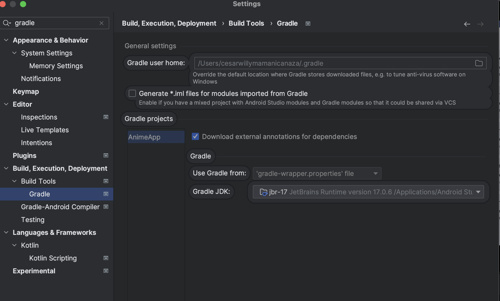
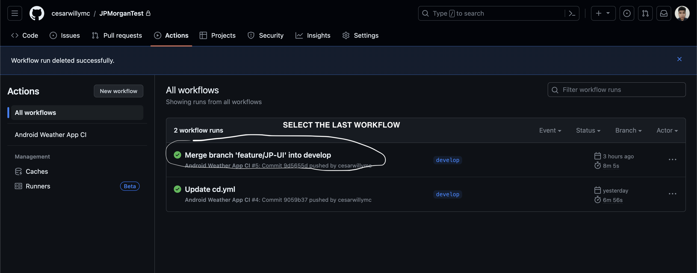
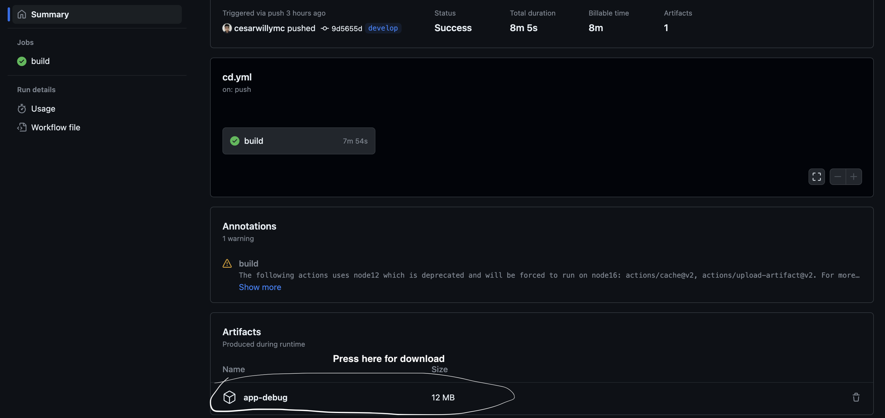

# MBCGroup
## CESAR CANAZA

Mobile developer willing to learn old and new technologies, I like the team work and communication.
Thank you for check this project.

- 
## Architecture MVVM with clean

### data (Repositories - Framework)
- di: Contains the dependency injection with hilt
- settings: Contains all the settings local `(Convertes, SharedEncription)` and network `(Interceptor, Cookie, more)`
- sources: Contains all the content of each feature `For example: Auth` like `framework database or retrofit` the connection is through repository
    - di: Contains the dependency injection of the Feature like `Auth`
    - entities: Contains all the entities of the feature like `Auth`
    - mapper: Contains all the mapper of the feature
    - local: Contains the framework with the local storage
    - remote: Contains the framework to connect the data using `voley, retrofit or other`
    - repository files: Contains the interface and the implementation of the connections with the local and remote data
### domain (Model - Use Case)
- usecase:
    - entities: Contains all the entities in domain with the logic if they have
    - usecase Files:  Contains each use case of the app where we can sort, filter  and others
### presentation (ViewModel - Screen UI)
- Main Activity: Contains the main activity in jetpack compose
- Screen Directory: Contains all the resources that manage a screen like **View Model, CustomComposable, State, Screen**
- delegate: Contains Singleton classes that work when we need to share contents between ViewModel where we **delegate the action to do something** or **save something light**
### Additional comments
- ui: Package that contains all the layers like ** General Composables, NavigationComponent, Theme, Services**
- util: Contains global Constants and Extension Functions
## FILE WITH JAVA
- domain/base/SuspendNoParamsUseCase.java
- data/sources/search/mapper/SearchResultMapperImpl.java
- data/sources/search/local/SearchLocalDataSourceImpl.java
## Technology Stack
- Kotlin  Programming language
- Java:  Programming language
- MVVM:  Architecture design that help us to decouple our code in layers
- Retrofit:  Library that help us to consume ApiRest
- JUnit: Framework that help us to test code
- Kotlin Coroutines: Provides ways to manage threads very easily
- Flow: Library that help us to manage the asynchronous stream data
- Mockk: Library for Mock data in the unit test
- Jetpack Compose:  Framework for UI using Kotlin where we developed the code like puzzles
- Hilt: Dependency Injection in Compile-Time
- GraphQL: A query language for your API
- Jetpack Navigation:  library that simplify and streamline the navigation between composables or screens
- Jacoco: Generate Files of the coverage of the unit test
- KLint: Format the code for give my quality to the project
- Detekt: Code analysis tool that help us to follow rules in the code
- others like:  Google accompanist, Turbine ....
## Configuration:
### Local.properties
Add  this line
```
SHARED_PREFERENCES_NAME=DB
BASE_URL=https://survey-api.nimblehq.co/
BASE_URL_GQL=https://survey-api.nimblehq.co/graphql
CLIENT_SECRET=clientSecret that you provide me
CLIENT_ID=clientID that you provide me
DEBUG_KEY_PASSWORD=holacomoestas
```
### Gradle Java

Go to **Gradle JDK** and change to **Java17**



### DOWNLOAD APP
## Download the app by Google Drive
- [GOOGLE DRIVE](https://drive.google.com/drive/folders/1ooIac0de2HlyxdFreRy6ydY5dr3QnSXK?usp=sharing)
## Download the app by artifact github
Go to [Here](https://github.com/cesarwillymc/MBCGroup/actions)
-   
  Later select the first workflow and download the apk
-   